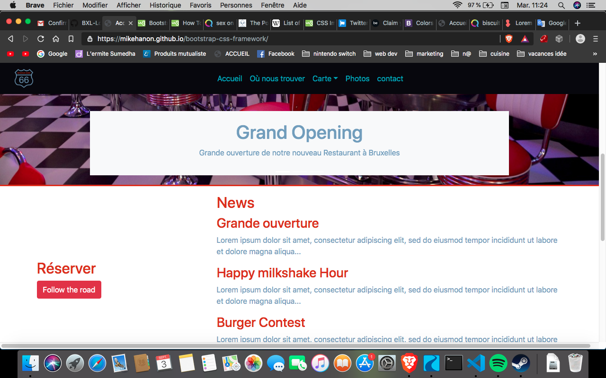

# Bootstrap-css-framework

Réalisation d'un site web multi-page a l'aide du framework bootstrap 4

**A quoi ça ressemble ?** [site](https://mikehanon.github.io/bootstrap-css-framework/.)

## Construit avec

* Html5
* CSS3
* BOOTSTRAP4

## Autheurs

* **Hanon Mikhaïl** - *Travail initial* - (https://github.com/MikeHanon)

    * **Lien LinkedIn** : https://www.linkedin.com/in/mikhailhanon/

## Remerciements

* Be Burger pour l'inspiration des burger ;)

